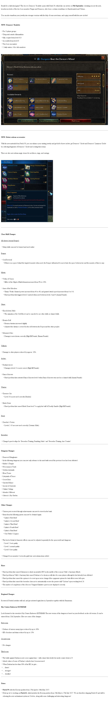

# html to image

Correction: it's actually xhtml right now

I had the sudden need to send lots of md and html
to a service with a 2000 character limit (yes Discord).

So why not just send an image?
1. html -> image
2. md -> html -> image

One possible solution is to use [Puppeteer](https://github.com/GoogleChrome/puppeteer) and its screenshot function but I can't run that on my server since it has low specs. Also I only want part of page because webscraping + extracting only part of the page's source.

So enter this. A super stripped html parser and renderer. Eh I'm still working on it.

Can do:
- [ ] Parsing
    - [x] Handle *empty* tags
    - [x] Replace entities in content
    - [ ] Add handling for more tags
        - [ ] Tables
        - [ ] Stop using same tag for different tags e.g. p, div
    - [x] Add proper handling for attributes
    - [x] Make classes based on behavior and not tag name
    - [ ] Parse properly i.e. fallbacks
- [ ] Rendering
    - [x] Automatically increase height as needed
    - [x] Handle inline content properly
    - [ ] Make renderer render better
    - [x] Remove extra spaces from inline content
    - [ ] Organization improvements
    - [ ] Font options
    - [ ] Other aesthetic options
- [ ] Other
    - [ ] Documentation
    
# Example of current output:

